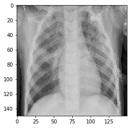

## Visualizing Activation Functions - Lab

## Introduction

Now that you've built your own CNN and seen how to visualize feature maps, its time to practice loading a pretrained model from file and practice visualizing the learned features systematically. In this lab, you'll expand upon the code from the previous lesson in order to succinctly visualize all the channels from each layer in a CNN.

## Objectives

You will be able to:

* Load a saved model
* Visualize the filters produced by hidden layers in a CNN

## Load a Model  

For this lab, we have saved a model **chest_xray_all_with_augmentation_data.h5**.  
This saved file includes both the model architecture and the trained weights. See the `model.save()` method for further details. The model was built in order to help identify patients with pneumonia. Start simply by loading the model and pulling up a summary of the layers. (To load the model use the `keras.models.load_model` method.) 


```python
#Your code here
from keras.models import load_model
model = load_model('chest_xray_all_with_augmentation_data.h5')
model.summary()
```

    /Users/matthew.mitchell/anaconda3/lib/python3.6/site-packages/h5py/__init__.py:36: FutureWarning: Conversion of the second argument of issubdtype from `float` to `np.floating` is deprecated. In future, it will be treated as `np.float64 == np.dtype(float).type`.
      from ._conv import register_converters as _register_converters
    Using TensorFlow backend.


    _________________________________________________________________
    Layer (type)                 Output Shape              Param #   
    =================================================================
    conv2d_1 (Conv2D)            (None, 148, 148, 32)      896       
    _________________________________________________________________
    max_pooling2d_1 (MaxPooling2 (None, 74, 74, 32)        0         
    _________________________________________________________________
    conv2d_2 (Conv2D)            (None, 72, 72, 64)        18496     
    _________________________________________________________________
    max_pooling2d_2 (MaxPooling2 (None, 36, 36, 64)        0         
    _________________________________________________________________
    conv2d_3 (Conv2D)            (None, 34, 34, 128)       73856     
    _________________________________________________________________
    max_pooling2d_3 (MaxPooling2 (None, 17, 17, 128)       0         
    _________________________________________________________________
    conv2d_4 (Conv2D)            (None, 15, 15, 128)       147584    
    _________________________________________________________________
    max_pooling2d_4 (MaxPooling2 (None, 7, 7, 128)         0         
    _________________________________________________________________
    flatten_1 (Flatten)          (None, 6272)              0         
    _________________________________________________________________
    dense_1 (Dense)              (None, 512)               3211776   
    _________________________________________________________________
    dense_2 (Dense)              (None, 1)                 513       
    =================================================================
    Total params: 3,453,121
    Trainable params: 3,453,121
    Non-trainable params: 0
    _________________________________________________________________


## Load an Image

Before we plot the learned representations of the convolutional base, let's import an image and display it prior to processing. This will provide us a comparison to the transformations formed by the model's feature maps.   

Load and display the image **person3_virus_16.jpeg**.


```python
#Your code here
from keras.preprocessing import image
import matplotlib.image as mpimg
import matplotlib.pyplot as plt
%matplotlib inline

filename = 'person3_virus_16.jpeg'
img = image.load_img(filename, target_size=(150, 150))
plt.imshow(img)
plt.show()
```


## Transform the Image to a Tensor and Visualize Again

Recall that we will always preprocess our images into tensors when using deep learning. As such, preprocess this image and then redisplay the tensor.


```python
#Your code here
import numpy as np

img_tensor = image.img_to_array(img)
img_tensor = np.expand_dims(img_tensor, axis=0)

#Follow the Original Model Preprocessing
img_tensor /= 255.

#Check tensor shape
print(img_tensor.shape)

#Preview an image
plt.imshow(img_tensor[0])
plt.show()
```

    (1, 150, 150, 3)





## Plot Feature Maps

Now that we've loaded a model, practice visualizing each of the channels for each of feature maps of the convolutional layers. Recall that this process will take a few steps. First, extract the feature maps, or layer outputs from each of the activation functions in the model. From there, generate models that transform the image from its raw state to these feature maps. From there, you can then take these transformations and visualize each channel for each feature map.  

To preview the results of our solution code, take a sneek peak at the Intermediate_Activations_Visualized.pdf file.


```python
#Your code here
from keras import models
import math #used for determining the number of rows in our figure below

# Extract model layer outputs
layer_outputs = [layer.output for layer in model.layers[:8]]

# Create a model for displaying the feature maps
activation_model = models.Model(inputs=model.input, outputs=layer_outputs)

activations = activation_model.predict(img_tensor)

#Extract Layer Names for Labelling
layer_names = []
for layer in model.layers[:8]:
    layer_names.append(layer.name)

total_features = sum([a.shape[-1] for a in activations])
total_features

n_cols = 16
n_rows = math.ceil(total_features / n_columns)


iteration = 0
fig , axes = plt.subplots(nrows=n_rows, ncols=n_columns, figsize=(n_cols, n_rows*1.5))

for layer_n, layer_activation in enumerate(activations):
    n_channels = layer_activation.shape[-1]
    for ch_idx in range(n_channels):
        row = iteration // n_columns
        column = iteration % n_columns
    
        ax = axes[row, column]

        channel_image = layer_activation[0,
                                         :, :,
                                         ch_idx]
        # Post-process the feature to make it visually palatable
        channel_image -= channel_image.mean()
        channel_image /= channel_image.std()
        channel_image *= 64
        channel_image += 128
        channel_image = np.clip(channel_image, 0, 255).astype('uint8')

        ax.imshow(channel_image, aspect='auto', cmap='viridis')
        ax.get_xaxis().set_ticks([])
        ax.get_yaxis().set_ticks([])
        
        if ch_idx == 0:
            ax.set_title(layer_names[layer_n], fontsize=10)
        iteration += 1

fig.subplots_adjust(hspace=1.25)
plt.savefig("Intermediate_Activations_Visualized.pdf")
plt.show()
```

    /Users/matthew.mitchell/anaconda3/lib/python3.6/site-packages/ipykernel_launcher.py:41: RuntimeWarning: invalid value encountered in true_divide


## Summary

Nice work! In this lab, you practiced loading a model and then visualizing the activation feature maps learned by that model on your data! In the upcoming labs and sections you will build upon the first part of this and see how you can adapt the representations learned by more experienced models to your own applications which may have limited training data.
